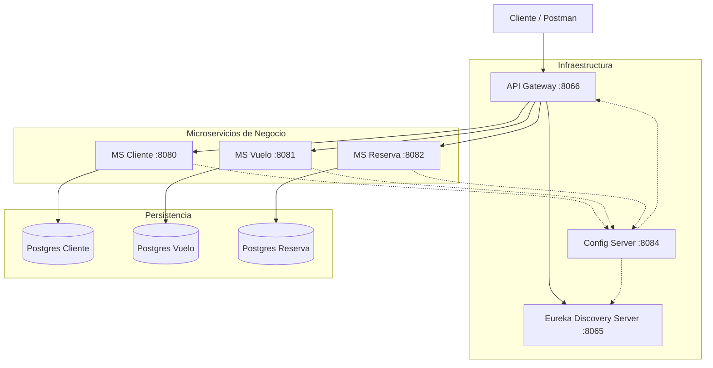

# ✈️ AndesFly - Arquitectura de Microservicios para Gestión Aérea

[](https://www.oracle.com/java/)
[](https://spring.io/projects/spring-boot)
[](https://www.docker.com/)
[](LICENSE)

**AndesFly** es una plataforma distribuida diseñada para la gestión de reservas de vuelos, clientes e itinerarios. Este proyecto implementa una arquitectura de microservicios robusta utilizando el ecosistema **Spring Cloud**, containerización con **Docker** y persistencia políglota con instancias aisladas de **PostgreSQL**.

> **Nota:** Este repositorio es un portafolio académico. Las credenciales y configuraciones sensibles han sido sanitizadas para su publicación.

---

## 🏗️ Arquitectura del Sistema

El sistema sigue el patrón de **Arquitectura de Microservicios**, desacoplando la lógica de negocio en servicios autónomos orquestados por componentes de infraestructura.



### Componentes Principales

| Servicio | Tecnología | Puerto | Descripción |
|----------|------------|--------|-------------|
| **Config Server** | Spring Cloud Config | `8084` | Centraliza la configuración de todos los microservicios (Perfil `native` activado). |
| **Eureka Server** | Netflix Eureka | `8065` | Service Discovery. Permite que los servicios se encuentren dinámicamente. |
| **API Gateway** | Spring Cloud Gateway | `8066` | Punto de entrada único. Maneja enrutamiento y seguridad. |
| **MS Cliente** | Spring Boot | `8080` | Gestión de usuarios y perfiles. |
| **MS Vuelo** | Spring Boot | `8081` | Catálogo de vuelos y destinos. |
| **MS Reserva** | Spring Boot | `8082` | Gestión de reservas y orquestación entre Cliente/Vuelo. |

---

## 🚀 Tecnologías y Patrones

* **Lenguaje:** Java 17 (Eclipse Temurin)
* **Framework:** Spring Boot 3.5.7
* **Nube & Configuración:** Spring Cloud (Config, Gateway, Netflix Eureka)
* **Seguridad:** Spring Security + JWT (JSON Web Tokens)
* **Comunicación:** RESTful APIs (Síncrona - OpenFeign)
* **Base de Datos:** PostgreSQL 15 (Patrón *Database-per-service*)
* **Infraestructura:** Docker & Docker Compose (Healthchecks y Redes aisladas)

---

## 🛠️ Instalación y Ejecución

Este proyecto está totalmente "Dockerizado". No necesitas instalar Java ni PostgreSQL localmente, solo Docker.

### Prerrequisitos
* Docker y Docker Compose instalados.
* Git.

### Pasos para ejecutar

1.  **Clonar el repositorio:**
    ```bash
    git clone https://github.com/lautaroliqui/AndesFly-Microservices-Architecture.git
    cd AndesFly-Microservices-Architecture
    ```

2.  **Levantar el entorno:**
    Ejecuta el orquestador maestro. Esto construirá las imágenes y levantará la infraestructura en el orden correcto (esperando a que el Config Server esté "healthy").
    ```bash
    docker-compose up -d --build
    ```

3.  **Verificar estado:**
    Accede al Dashboard de Eureka para ver los servicios registrados:
    👉 [http://localhost:8065](http://localhost:8065)

---

## 🧪 Endpoints Principales (Vía Gateway)

Una vez el sistema esté arriba, puedes consumir la API a través del puerto **8066** (Gateway).

* **Clientes:** `GET http://localhost:8066/api/v1_1/clientes`
* **Vuelos:** `GET http://localhost:8066/api/v1_1/vuelos`
* **Reservas:** `POST http://localhost:8066/api/v1_1/reservas`

---

## 👤 Autor

**Lautaro Emmanuel Liquitay Linares**
* Estudiante de Ingeniería Informática - Universidad Nacional de Jujuy
* [GitHub Profile](https://github.com/lautaroliqui)
* [LinkedIn](https://www.linkedin.com/in/lautaro-molina-b67484218/)

---